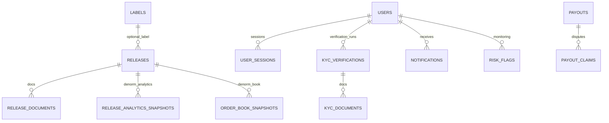

# Spliton Database ERD

## MVP ERD

```mermaid
erDiagram
  USERS ||--|| USER_PROFILES : has
  USERS ||--o{ USER_ROLES : assigned
  ROLES ||--o{ USER_ROLES : grants

  RELEASES ||--o{ RELEASE_ARTISTS : includes
  ARTISTS ||--o{ RELEASE_ARTISTS : participates
  RELEASES ||--o{ RELEASE_METRICS_DAILY : tracks
  RELEASES ||--o{ RELEASE_SHARE_LOTS : allocates

  USERS ||--o{ USER_POSITIONS : owns
  RELEASES ||--o{ USER_POSITIONS : belongs_to
  USERS ||--o{ OWNERSHIP_LEDGER : events
  RELEASES ||--o{ OWNERSHIP_LEDGER : events

  USERS ||--o{ MARKET_LISTINGS : creates
  RELEASES ||--o{ MARKET_LISTINGS : lists

  USERS ||--o{ ORDERS : places
  RELEASES ||--o{ ORDERS : market
  MARKET_LISTINGS ||--o{ ORDERS : source

  ORDERS ||--o{ ORDER_FILLS : has
  TRADES ||--o{ ORDER_FILLS : contains
  RELEASES ||--o{ TRADES : executes
  USERS ||--o{ TRADES : buyer
  USERS ||--o{ TRADES : seller
  RELEASES ||--o{ PRICE_HISTORY : candles

  USERS ||--o{ WALLETS : owns
  WALLETS ||--|| WALLET_BALANCES : aggregate
  WALLETS ||--o{ WALLET_TRANSACTIONS : ledger
  WALLET_TRANSACTIONS ||--o| DEPOSITS : deposit_meta
  WALLET_TRANSACTIONS ||--o| WITHDRAWALS : withdrawal_meta
  WALLET_TRANSACTIONS ||--o{ FEES : fee_events

  RELEASES ||--o{ EARNING_PERIODS : accrual_periods
  EARNING_PERIODS ||--o{ EARNING_REPORTS : source_reports
  EARNING_PERIODS ||--o{ EARNING_DISTRIBUTIONS : distributions
  EARNING_DISTRIBUTIONS ||--o{ PAYOUTS : user_allocations
  USERS ||--o{ PAYOUTS : receives
  WALLET_TRANSACTIONS ||--o{ PAYOUTS : settlement_tx

  USERS ||--o{ ADMIN_ACTIONS : executes
  USERS ||--o{ AUDIT_LOGS : actor
```

## Optional / Later Tables

## Notes

- `trades` + `order_fills` + `orders` = execution truth on secondary market.
- `wallet_transactions` = money ledger truth.
- `ownership_ledger` = units ownership truth.
- `wallet_balances` and `user_positions` are fast-read aggregates derived from ledgers.
